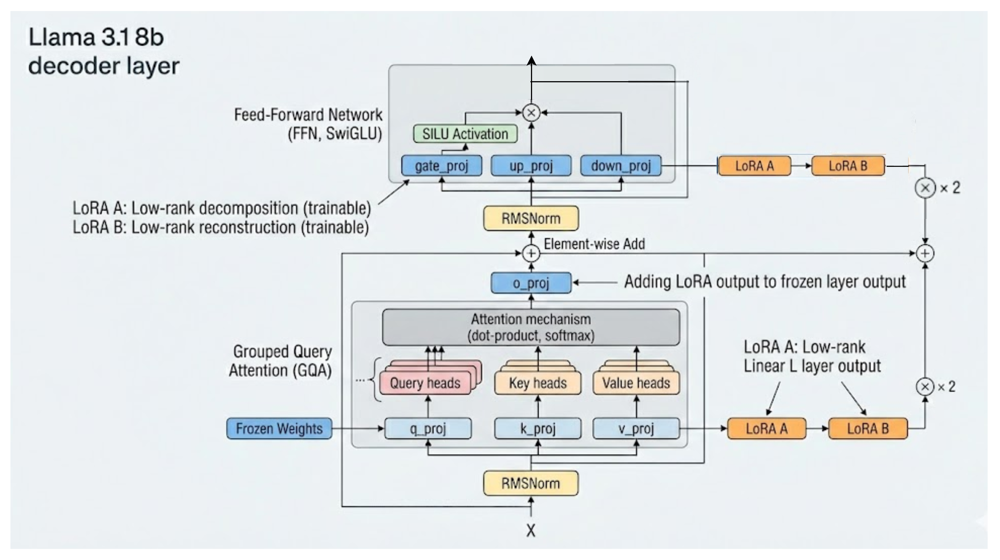

# LoRA 微调详解

> 参考论文：https://arxiv.org/pdf/2106.09685

下面从**原理、加在什么位置、参数/算力开销对比、以及如何计算**四个层面，系统地讲一下 **LoRA（Low-Rank Adaptation）微调**。

---

## 一、LoRA 微调的核心思想

LoRA 的出发点是一个经验事实：

> **大模型在下游任务上的更新，往往落在一个低秩子空间里**
> 换句话说，不需要完整更新一个 (d \times k) 的大矩阵。

### 标准全参数微调

以 Transformer 中一个线性层为例：

\[
y = Wx,\quad W \in \mathbb{R}^{d \times k}
\]

全参数微调：

* 直接更新整个 (W)
* 可训练参数量：(d \times k)

---

### LoRA 的做法

冻结原始权重 (W_0)，只学习一个**低秩增量**：

\[
W = W_0 + \Delta W
\]

并且强制：

\[
\Delta W = B A
\]

其中：

* (A \in \mathbb{R}^{r \times k})
* (B \in \mathbb{R}^{d \times r})
* (r \ll \min(d, k))（典型值 4 / 8 / 16）

所以前向变为：

\[
y = W_0 x + B(Ax)
\]

---

## 二、Low-rank 矩阵加在什么位置？

### 常见注入位置（Transformer）

LoRA **不是加在 embedding 或 FFN 的所有层**，而是**选择性加在线性变换处**：

#### 最常见配置（几乎所有 LLM 微调）：

* Attention 模块：
  * **Query 投影 (W_q)**
  * **Value 投影 (W_v)**

有时也包括：

* Key (W_k)
* Output (W_o)
* FFN 的 (W_up, W_down)



---

### 代码/结构层面理解

原本线性层：

```text
Linear(in_features=k, out_features=d)
```

LoRA 版本等价于：

```text
y = W0 x + B(Ax)
```

其中：

* W0：冻结
* A、B：新增的可训练参数

实现上通常是：

* 一个 **down projection（A）**
* 接一个 **up projection（B）**
* 初始化时 B 为 0，保证一开始等价于原模型

---

## 三、参数 & 训练开销比全参数微调低多少？

这是 LoRA 最大的优势。

---

### 参数量对比（核心）

假设某线性层：

* (W \in \mathbb{R}^{d \times k})

#### 全参数微调

\[
\text{params}_{\text{full}} = d \times k
\]

---

#### LoRA 微调

\[
\text{params}_{\text{LoRA}} = r \times k + d \times r = r(d + k)
\]

---

### 参数比例公式（非常重要）

\[
\frac{\text{LoRA}}{\text{Full}} = \frac{r(d+k)}{d k}
\]

---

### 实际数字举例（LLM 常见）

以 LLaMA / GPT 类模型的 attention 投影为例：

* (d = k = 4096)
* rank (r = 8)

#### 全参数：

\[
4096 \times 4096 \approx 1.68 \times 10^7
\]

#### LoRA：

\[
8 \times (4096 + 4096) = 65536
\]

#### 比例：

\[
\frac{6.6 \times 10^4}{1.68 \times 10^7} \approx 0.39%
\]

👉 **不到 0.5% 的参数量**

---

### 整个模型层面（经验值）

| 方法              | 可训练参数占比       |
| --------------- | ------------- |
| 全参数微调           | 100%          |
| LoRA (Q,V, r=8) | **0.2% ~ 1%** |
| LoRA (Q,K,V,O)  | 1% ~ 2%       |

---

## 四、训练 & 显存开销为什么也大幅下降？

### 优化器状态减少

以 Adam 为例：

* 每个参数需要：
  * 参数本身
  * 一阶矩
  * 二阶矩

👉 **3× 参数量显存**

LoRA：

* 只有 A、B 需要优化器状态
* 原模型权重不进 optimizer

---

### 反向传播更轻

* 梯度只在 LoRA 参数上传播
* 不需要为原始权重保存中间梯度

---

### 显存对比（经验）

| 微调方式               | 显存占用         |
| ------------------ | ------------ |
| 全参微调 7B            | 60–80 GB     |
| LoRA 微调 7B         | **15–25 GB** |
| QLoRA（4bit + LoRA） | **<10 GB**   |

---

## 五、LoRA scale（α）是干什么的？

实际使用中：

\[
\Delta W = \frac{\alpha}{r} B A
\]

* (\alpha)：LoRA scaling factor
* 控制 LoRA 更新强度
* 常见：(\alpha = 16, 32)

**直觉**：

* rank 决定表达能力
* α 决定更新幅度

---

## 六、什么时候 LoRA 不适合？

* 任务与预训练分布差异极大（如跨模态）
* 需要显著修改底层表征（如 tokenizer / embedding）
* 小模型 + 小数据（全参可能更好）

---

## 七、一句话总结

> **LoRA = 冻结大模型 + 在线性层上学习一个低秩"补丁"**

* Low-rank 矩阵：**加在 Transformer 的线性投影权重上**
* 参数量：
  \[
  \text{从 } O(dk) \rightarrow O(r(d+k))
  \]
* 实际开销：**只有全参微调的 0.1%–2%**
* 显存和训练成本大幅下降，是当前 LLM 微调的事实标准

---

## 八、为什么除以 r？（深入思考）

> **(\Delta W) 要除以 (r)，本质原因是：
> 👉 让 LoRA 的"有效更新幅度"与 rank (r) 解耦，
> 避免 rank 变大时更新能量线性放大，导致训练不稳定。**

标准形式：

\[
\Delta W = \frac{\alpha}{r} BA
\]

---

### 如果不除以 (r)，会发生什么？

假设你用：

\[
\Delta W = BA
\]

其中：

* (A \in \mathbb{R}^{r \times k})
* (B \in \mathbb{R}^{d \times r})

#### 关键事实

矩阵乘法中：

\[
BA = \sum_{i=1}^{r} b_i a_i^\top
\]

也就是说：

> **rank = r，本质是把 r 个 rank-1 更新"加起来"**

---

#### 不除 (r) 的后果

* 每增加一个 rank
* 就多加一个 rank-1 更新项
* (|\Delta W|)（Frobenius / spectral norm）**近似 ∝ r**

👉 rank=64 的更新幅度，大约是 rank=8 的 **8 倍**

这在优化上是**灾难性的**。

---

### 除以 (r) 的数学直觉（能量守恒）

我们看 Frobenius norm 的期望（直觉级推导）：

假设：

* (A,B) 初始化为均值 0、方差 (\sigma^2)
* 各 rank 方向近似独立

则：

\[
\mathbb{E}|BA|_F^2 \propto r \cdot \sigma^4
\]

如果改成：

\[
\Delta W = \frac{1}{r} BA
\]

则：

\[
\mathbb{E}|\Delta W|_F^2 \propto \frac{r}{r^2} = \frac{1}{r}
\]

👉 **rank 越大，单方向贡献越小**
👉 总体能量被"规范化"了

这和：

* Xavier / Kaiming 初始化
* multi-head attention 的 `1/√d`

是**同一类缩放思想**

---

### 为什么是除 r，不是除 √r？

这是一个常被问到的细节。

#### 理论上

* 如果你严格按方差推导
* 用 (1/\sqrt{r}) 也说得通

#### 但 LoRA 选择 1/r，原因是：

---

#### LoRA 的 rank 是**表达能力超参**

作者希望：

* rank ↑ → **容量 ↑**
* 而不是：
* rank ↑ → **更新幅度 ↑**

所以：

\[
\text{capacity} \uparrow,\quad
\text{step size} \approx \text{constant}
\]

---

#### 把"幅度控制"交给 (α)

LoRA 设计是：

\[
\Delta W = \frac{\alpha}{r} BA
\]

也就是说：

* (r)：**形状 / 维度**
* (\alpha)：**强度 / 幅度**

这让调参解耦：

| 超参 | 控制什么  |
| -- | ----- |
| r  | 子空间维度 |
| α  | 更新强度  |

如果不用 `/r`：

* α 和 r 强耦合
* 调参会非常难

---

#### 实践稳定性（非常现实）

在真实 LLM 微调中：

* r 常从 4 → 8 → 16 → 64
* 不除 r：
  * loss 爆
  * 需要重新调 LR
* 除 r：
  * 同一学习率可复用
  * scaling 行为可预测

👉 **这是工程上"必须"的设计**

---

### 为什么 B 常初始化为 0？

你可能会追问这个（顺便讲清）：

PEFT 默认：

* A：标准初始化
* B：全 0

这样：

\[
\Delta W = 0 \quad (\text{at init})
\]

模型一开始 **完全等价于原模型**。

而 `/r` 的存在保证：

* 训练初期梯度规模稳定
* 不会因为 r 大而突然注入大扰动

---

### 和 Multi-Head Attention 的类比（非常重要）

| 模块        | 缩放                    |
| --------- | --------------------- |
| Attention | (QK^\top / \sqrt{d})  |
| LoRA      | (BA \cdot \alpha / r) |

**本质相同**：

> **防止"维度增加 → 数值爆炸"**

---

### 一句话总结（你可以直接记）

> **LoRA 除以 r，不是数学洁癖，而是：
> 让"rank 控制容量、α 控制幅度"，
> 保证 rank 变化不破坏训练稳定性。**

---

## 九、结合代码：LoRA 微调完整流程


### LoRA 微调涉及的库，各自负责什么？


```
Transformers（模型/Tokenizer）
        ↑
      PEFT（LoRA 注入）
        ↑
      TRL（SFTTrainer）
        ↑
   Accelerate（隐式，用于 device_map / FP16）
```

---

#### transformers：提供"被冻结的基座模型"

```python
AutoModelForCausalLM.from_pretrained(...)
```

**它负责：**

* 加载 `Meta-Llama-3.1-8B-Instruct`
* 构建标准 Transformer 结构：
  * attention：`q_proj/k_proj/v_proj/o_proj`
  * MLP：`gate_proj/up_proj/down_proj`
* 提供标准 forward（未被 LoRA 改写前）

⚠️ 注意：
在 **LoRA 场景**下，transformers 模型的 **原始权重全部被冻结**。

---

#### PEFT（核心）：把 LoRA 的数学公式"落地成模块"

```python
from peft import LoraConfig
```

##### PEFT 在干什么？

PEFT 做了三件关键的事：

---

##### 替换指定 Linear 层

```python
target_modules=\[
    "q_proj", "k_proj", "v_proj", "o_proj",
    "gate_proj", "up_proj", "down_proj",
\]
```

这一步对应 **LoRA 原理中的：**

> 在 ( W_0 ) 上加一个低秩增量 ( \Delta W = BA )

PEFT 会把这些模块：

```text
nn.Linear(in=k, out=d)
```

替换成：

```text
W0 x + (α / r) * B(Ax)
```

---

##### 冻结原权重，只让 LoRA 参数可训练

PEFT 自动做：

```text
requires_grad(W0) = False
requires_grad(A, B) = True
```

所以 **优化器里只有 LoRA 参数**。


---

##### 维护 LoRA scaling 逻辑

```python
r=64
lora_alpha=16
```

对应公式：

\[
\Delta W = \frac{\alpha}{r} BA
\]

在设置里：

\[
\text{scale} = \frac{16}{64} = 0.25
\]

这意味着：

* rank 很高（64）
* 但每个 rank 的贡献被压小
* **更稳、更偏"细调"**

---

#### TRL（SFTTrainer）：把"语言模型 + LoRA"变成 SFT 训练

```python
from trl import SFTTrainer
```

##### SFTTrainer 的本质

SFTTrainer 是：

> **Trainer + Causal LM + Prompt Formatting 的组合封装**

它负责：

* 构造 `(input_ids, labels)`
* 对 labels 做：

  ```text
  shift + ignore pad token
  ```
* 调用标准的：

  ```python
  loss = CrossEntropy(logits, labels)
  ```

⚠️ **重要点**：
**SFTTrainer 并不知道 LoRA 的存在**
它只是：

* forward
* backward
* optimizer.step()

LoRA 的低秩约束 **完全在 PEFT 那一层生效**。

---

### LoRA 配置逐项对照"原理"


#### r=64：低秩维度

```python
r=64
```

对应：

\[
A \in \mathbb{R}^{64 \times k}, \quad
B \in \mathbb{R}^{d \times 64}
\]

**含义：**

* rank 64 在 8B 模型中属于 **偏大的 rank**
* 你是：
  * QKV + O
  * FFN 全打
* 属于 **高表达能力 LoRA**

参数量估算（单层）：

\[
64 \times (d + k)
\]

远小于：

\[
d \times k
\]

---

#### lora_alpha=16：更新幅度控制

```python
lora_alpha=16
```

不是"学习率"，而是：

\[
\Delta W = \frac{16}{64} BA
\]

经验解读：

* rank ↑ → α 通常不必同比 ↑
* 否则等效更新会太猛
* 你这个组合：**稳**

---

#### lora_dropout=0.05

```python
lora_dropout=0.05
```

**作用位置：**

```text
x → dropout → A → B
```

不是对原模型，而是**只对 LoRA 分支**

作用：

* 防止 LoRA 过拟合
* 在小数据 SFT 中尤其重要

---

#### bias="none"

```python
bias="none"
```

表示：

* 不对原 Linear 的 bias 做任何适配
* 只学习 BA

这是：

* 最常见
* 参数最省
* 几乎不影响效果

---

#### task_type="CAUSAL_LM"

告诉 PEFT：

* loss 是 causal LM loss
* 自动匹配 attention / decoder-only 结构

---

### 你为什么选这些 target_modules？

你现在的配置是 **"全线性层 LoRA"**：

#### Attention：

* `q_proj`
* `k_proj`
* `v_proj`
* `o_proj`

#### FFN：

* `gate_proj`
* `up_proj`
* `down_proj`

这意味着：

> LoRA 不只是"调注意力"，而是**允许模型重塑计算流**

对应原理：

* attention LoRA：调"看什么"
* FFN LoRA：调"怎么变换表示"

⚠️ 代价：

* 参数量 ↑
* 显存 ↑

但在 **观点 / 指令 /风格类 SFT** 中，这是合理的。

---

### FP16 + device_map 在 LoRA 里的真实含义

```python
model_init_kwargs={
    "torch_dtype": "float16",
    "device_map": "auto",
    "use_cache": False,
}
```

#### torch_dtype=float16

* **原模型权重**：FP16
* **LoRA A/B**：FP16
* 梯度：FP16（AdamW 内部可能有 FP32 state）

这不会影响 LoRA 数学形式，只影响数值精度。

---

#### device_map="auto"

来自 Accelerate：

* 把冻结的大权重自动切到 GPU
* LoRA 权重跟着对应层走

⚠️ 因为 LoRA 参数很小：

* 不会成为 device map 的瓶颈

---

#### use_cache=False

这是**必须的**：

* 否则 KV cache 会：
  * 占显存
  * 干扰训练时的反向传播


