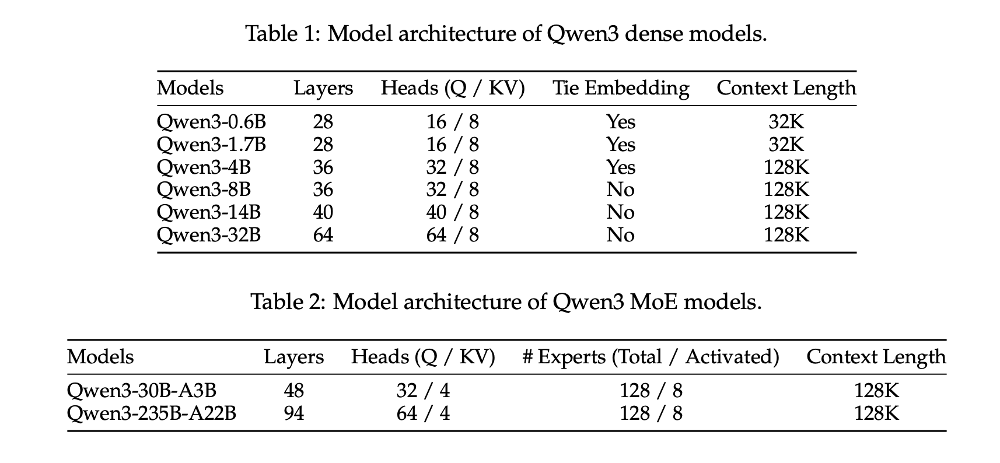
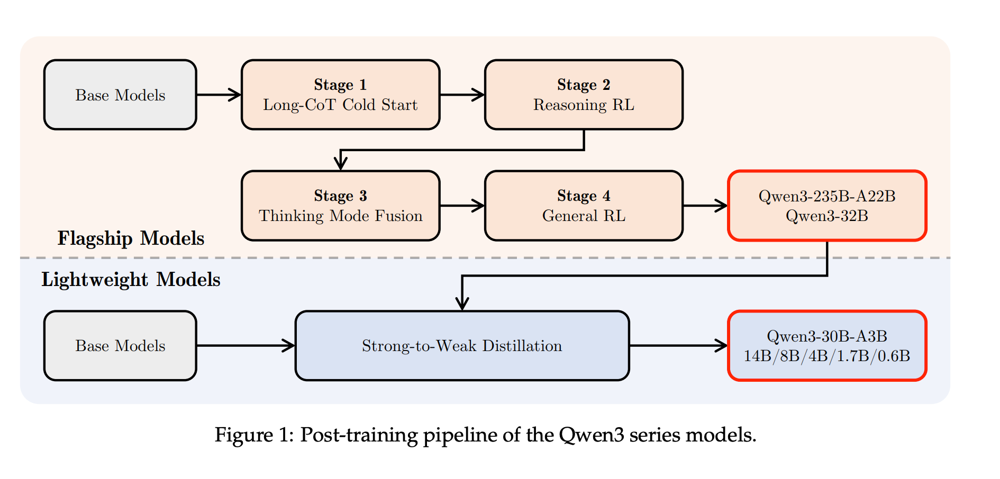

# Qwen3 Technical Report

## model

发布多个模型，包括6个dense模型和两个MOE模型




## pre-training
- 数据36T，**119种语言，**对比Qwen2.5 7T，**29种语言**

- ·训练步骤:

  General Stage (4K，30T数据) -> Reasoning Stage (5T reasoning 数据) ·> Long Context Stage(几百B长文本数据)

- 不同大小的模型评测指标**SOTA**


## Post-training



### think/no-think控制

- Special token 控制（enable_thinking=true/false）

  

- 在模型达到特定长度时，强制添加一句结束语: "Considering the limited time by the user, l have to give the solution based on the thinking directly now.\n</think>.\n\n"

- 模型自主决定

---

## 专业名词详解

### 1. Grouped Query Attention (GQA) - 组注意力

#### 基本概念

```
┌─────────────────────────────────────────────────────────────────┐
│              注意力机制的演进                                     │
├─────────────────────────────────────────────────────────────────┤
│                                                                 │
│  MHA (多头注意力)          MQA (多查询注意力)      GQA (组注意力)   │
│  ┌─────────────┐          ┌─────────────┐          ┌─────────────┐│
│  │ Q1 K1 V1   │          │             │          │ ┌───┐ ┌───┐ ││
│  │ Q2 K2 V2   │          │  Q1~Qn     │          │ │Q1 │ │Q1 │ ││
│  │ Q3 K3 V3   │          │  ┌───┐     │          │ │Q2 │ │Q2 │ ││
│  │ Q4 K4 V4   │    →     │  └───┘     │    →     │ │Q3 │ └───┘ ││
│  │ ...        │          │  共享KV    │          │ │Q4 │       ││
│  │ Qn Kn Vn   │          │             │          │ │...│       ││
│  └─────────────┘          └─────────────┘          │ │Qn │       ││
│     n组K,V                   1组K,V              │ └───┘       ││
│                                                   4组K,V        │
│  • KV缓存: n×d×L          • KV缓存: 1×d×L      • KV缓存: g×d×L│
│                                                                 │
└─────────────────────────────────────────────────────────────────┘
```

#### Qwen3-8B 中的 GQA 配置

| 参数 | 数值 |
|------|------|
| Query Heads (Q头数) | 32 |
| KV Heads (K,V头数) | 8 |
| 分组数 | 4 (32÷8=4，每组4个Q共享1个K,V) |

#### KV Cache 对比

```
假设序列长度 L=4096，隐藏层维度 d=128

模型类型     KV缓存大小              相比MHA加速
─────────────────────────────────────────────
MHA (32头)   32 × 128 × 4096 × 2  × 2B = 64MB   1x (基准)
MQA (1头)    1 × 128 × 4096 × 2 × 2B = 2MB     ~32x
GQA (8头)    8 × 128 × 4096 × 2 × 2B = 16MB    ~4x
```

#### 为什么 GQA 重要？

```
推理时的内存瓶颈：

┌─────────────────────────────────────────┐
│  推理时，KV Cache占用大量显存            │
│                                         │
│  序列越长，占用越多                     │
│                                         │
│  MHA: 32个K,V头，每个都要缓存           │
│  GQA: 只缓存8个K,V头，内存减少4倍        │
│                                         │
│  效果: 支持更长上下文，更快推理速度       │
└─────────────────────────────────────────┘
```

---

### 2. Tie Embedding - 绑定嵌入层

#### 基本概念

```
普通做法：                     Tie Embedding做法：
┌─────────────────┐          ┌─────────────────┐
│ Token Embedding │          │ Token Embedding │
│  (151643, 4096) │    =    │  (151643, 4096) │
└────────┬────────┘          └────────┬────────┘
         │                           │
         │ (不共享)                  │ (共享)
         ▼                           ▼
┌─────────────────┐          ┌─────────────────┐
│   LM Head       │          │   LM Head       │
│  (4096, 151643) │    =    │ (共享权重)      │
└─────────────────┘          └─────────────────┘

参数量：                      参数量：
Embedding: 151643×4096      Embedding: 151643×4096
LM Head: 4096×151643        LM Head: (共享)
────────────────────────────────────────────────────
总参数量: 约1.24B            总参数量: 约0.62B
```

#### Qwen3 中的应用

```python
# Hugging Face 实现
class Qwen3Model(nn.Module):
    def __init__(self, config):
        self.embed_tokens = nn.Embedding(config.vocab_size, config.hidden_size)
        # LM Head 绑定 Embedding 权重
        self.lm_head = nn.Linear(config.hidden_size, config.vocab_size, bias=False)
        self.lm_head.weight = self.embed_tokens.weight  # 权重共享
```

#### Tie Embedding 的优势

| 优势 | 解释 |
|------|------|
| **减少参数量** | 最后一层与嵌入层共享，节省约10%参数 |
| **加速训练** | 减少的参数量可以用于其他组件 |
| **正则化效果** | 隐式约束词表权重学习更加稳定 |
| **统一语义空间** | 输入和输出在同一语义空间 |

---

### 3. Long-CoT (Long Chain-of-Thought) - 长思维链

#### 基本概念

```
普通CoT:                        Long-CoT:
┌──────────────────┐           ┌──────────────────────────────┐
│ 输入 → 答案       │           │ 输入 → 思考过程 → 答案       │
│                  │           │                              │
│ "2+2=?"          │           │ "证明: 1+2+...+n = n(n+1)/2"│
│ → "4"            │           │ → 详细证明步骤 → 最终公式    │
└──────────────────┘           └──────────────────────────────┘
```

#### Long-CoT 训练方法

```
┌─────────────────────────────────────────────────────────────────┐
│              Long-CoT 训练流程                                    │
├─────────────────────────────────────────────────────────────────┤
│                                                                 │
│  Step 1: 冷启动 (Cold Start)                                    │
│  ┌─────────────────────────────────────────────────────────┐   │
│  │ • 使用高质量人工标注的思维链数据                          │   │
│  │ • 格式：问题 → 详细推理步骤 → 答案                       │   │
│  │ • 目的：让模型学会"如何思考"                            │   │
│  └─────────────────────────────────────────────────────────┘   │
│                           ↓                                    │
│  Step 2: 强化学习 (Reinforcement Learning)                     │
│  ┌─────────────────────────────────────────────────────────┐   │
│  │ • 奖励函数：基于结果正确性 + 格式规范                    │   │
│  │ • 策略优化：让模型生成更准确、更简洁的思维链             │   │
│  │ • 迭代：不断改进推理质量                                │   │
│  └─────────────────────────────────────────────────────────┘   │
│                                                                 │
└─────────────────────────────────────────────────────────────────┘
```

#### Cold Start (冷启动) 详解

```
为什么叫"冷启动"？

┌─────────────────────────────────────────┐
│  冷启动 = 没有参照的起点                 │
│                                         │
│  传统方法:                              │
│  • 直接强化学习                         │
│  • 问题: 随机策略，效果差               │
│                                         │
│  冷启动方案:                            │
│  • 先给一个"好答案"作为起点             │
│  • 再从这个起点开始优化                 │
│  • 效果: 稳定收敛 + 高质量              │
└─────────────────────────────────────────┘
```

#### Cold Start 数据示例

```json
{
  "problem": "小明有15个苹果，给了小红3个，又买了5个，现在有几个？",
  "cot": "让我逐步思考这个问题。首先，小明有15个苹果。然后，他给了小红3个，所以剩下15-3=12个。接着，他又买了5个，所以现在有12+5=17个。因此，小明现在有17个苹果。",
  "answer": "17"
}
```

#### Long-CoT vs 普通CoT

| 维度 | 普通CoT | Long-CoT |
|------|---------|----------|
| 推理长度 | 短 (few tokens) | 长 (数百 tokens) |
| 训练方法 | SFT直接训练 | RLHF + Cold Start |
| 适用场景 | 简单问答 | 复杂推理、证明 |
| 质量 | 一般 | 更高 |
| 推理时间 | 快 | 慢 |

---

